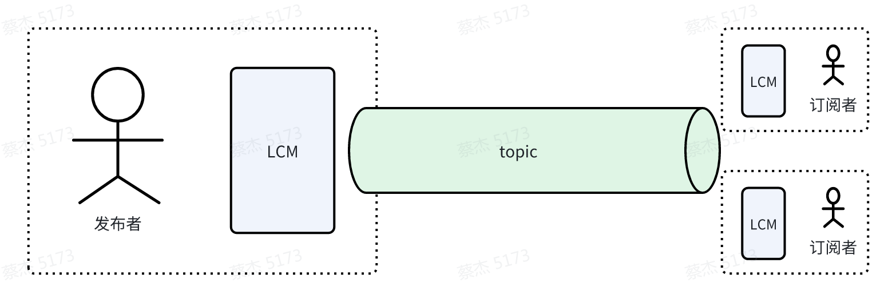
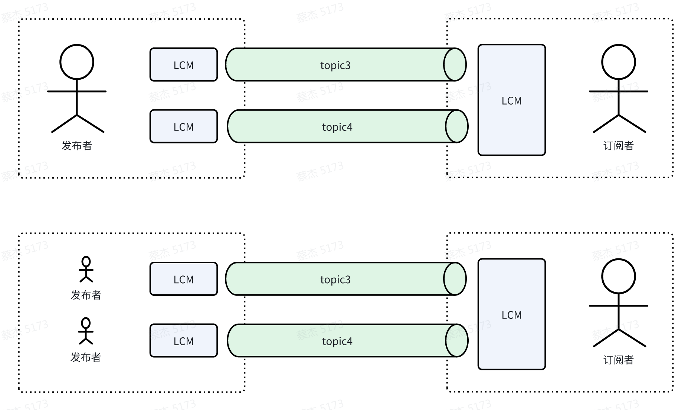
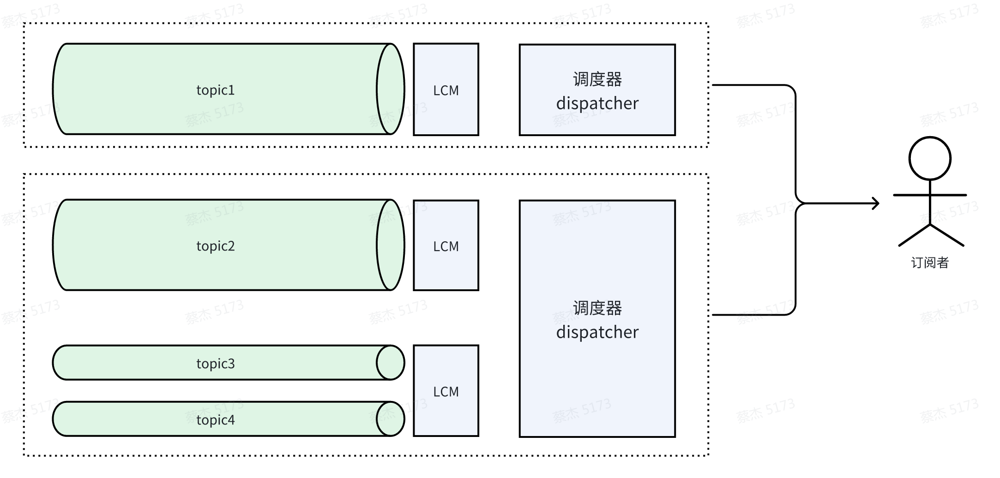

# LCM插件设计

## 整体设计思想

LCM（Lightweight Communications and Marshalling）是一套用于消息传递和数据编组的库和工具，针对高带宽和低延迟至关重要的实时系统。 它提供了一个发布/订阅消息传递模型和自动编组/解组代码生成，并为各种编程语言的应用程序提供绑定。
目前AIMRT使用LCM作为发布订阅的后端，需要做以下功能的支持：
1. 支持使用1个/多个LCM对象发布、订阅，支持配置LCM的URL。
2. 支持1个LCM对象发布/订阅多个TOPIC（原生支持）
3. 支持一个执行器管理1个/多个LCM对象的订阅处理（原生LCM对象需要有一个线程接收数据、处理回调）。
4. 支持配置TOPIC是否允许通过LCM出去，避免污染网络环境。

注：每个LCM对象可以认为是一条UDP组播通道，不同的topic可以左一个组播通道中传输，也可以在多个组播通道中传输。

## 资源分布

1. 对于发布者与订阅者来说，都必须创建一个LCM对象用于发布、订阅消息，拓扑结构可如下所示：

    

    

    

    

2. 对于订阅者可为每个LCM配置专用的调度器，也可将多个LCM对象放在同一个调度器上使用（需要为每个调度器分配AIMRT执行器资源）。

    

3. 如果一个AIMRT Core内加载了1个LCM插件，那么当前Core内将拥有一个LCM manager（单例模式），用于统一管理当前Core内的LCM对象。（正常情况下1个AIMRT Core可理解为单个进程，AIMRT框架支持单进程内多个Core）


## LCM插件使用


1. 1. 在plugin配置中添加共享LCM插件，如下：

    ```yaml
    plugin:
      plugins:
        - name: lcm_plugin
          path: ./libaimrt_lcm_plugin.so
    ```

    - name: 插件名称，必须为lcm_plugin
    - path: 插件路径，必须为./libaimrt_lcm_plugin.so

2. 订阅topic配置，在channel中添加LCM后端，如下：

    ```yaml
    channel: # 消息队列相关配置
      backends: # 消息队列后端配置
        - type: lcm
        options:
          sub_default_executor: lcm_default_thread_pool # 默认执行器
          sub_topic_options:
            - topic_name: '^[\w/#+-]+$' # 支持正则表达式，所有topic
              lcm_url: "udpm://239.255.76.67:7667?ttl=0"
              executor: lcm_default_thread_pool # 指定执行器
              priority: 10 # 优先级
    ```

    - type: 后端类型，必须为lcm
    - sub_default_executor: 默认执行器，对订阅者是必选配置，必须与执行器配置中的name一致。
    - sub_topic_options: 订阅topic的配置信息
      - topic_name：订阅者topic配置，用于配置订阅者需要订阅的topic信息，支持正则表达式，如上配置表示订阅所有topic，也可配置为具体的topic名称，**但不支持为空**。
      - lcm_url：可指定LCM的url，如果不配置则使用默认`udpm://239.255.76.67:7667?ttl=0`，url需要符合LCM规则。
      - executor: 执行器名称，可选配置，如果不配置则使用默认执行器。
      - priority: 优先级，可选配置，如果不配置则使用默认优先级，优先级数字越小，优先级越高，默认优先级为`std::numeric_limits<int32_t>::max()`。

3. 发布topic配置，在channel中添加LCM后端，如下：

    ```yaml
    channel: # 消息队列相关配置
      backends: # 消息队列后端配置
        - type: lcm
        options:
          pub_topic_options:
            - topic_name: '^[\w/#+-]+$' # 支持正则表达式，所有topic
              lcm_url: "udpm://239.255.76.67:7667?ttl=0"
              priority: 10 # 优先级
          passable_pub_topics:
            - '^[\w/#+-]+$'
          unpassable_pub_topics:
            - '/abc'
            - '/def'
    ```
      - type: 后端类型，必须为lcm
      - pub_topic_options：发布topic的配置信息，可选
        - topic_name：发布者topic配置，用于配置发布者需要发布的topic信息，支持正则表达式，如上配置表示发布所有topic都使用以下指定的lcm url，也可配置为具体的topic名称，但不支持为空。
        - lcm_url：可指定LCM的url，如果不配置则使用默认`udpm://239.255.76.67:7667?ttl=0`，url需要符合LCM规则。
        - priority: 优先级，可选配置，如果不配置则使用默认优先级，优先级数字越小，优先级越高，默认优先级为`std::numeric_limits<int32_t>::max()`。
      - passable_pub_topics: 可发布topic配置，支持正则表达式，如上配置表示可发布所有topic，也可配置为具体的topic名称，支持为空，如果为空则表示可发布任何topic。
      - unpassable_pub_topics: 不可发布topic配置，支持正则表达式，也可配置为具体的topic名称如上配置表示不可发布`/abc、/def`的topic，不支持为空。


