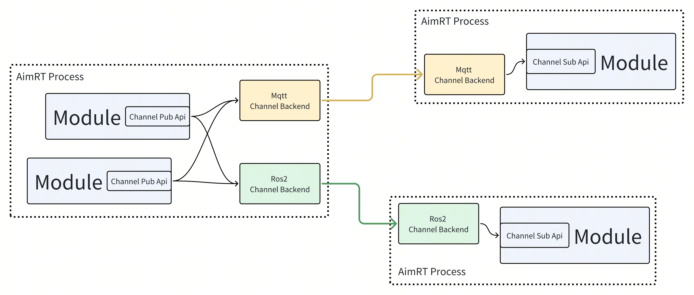
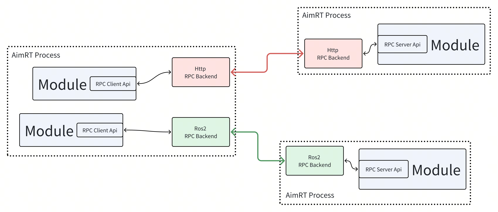
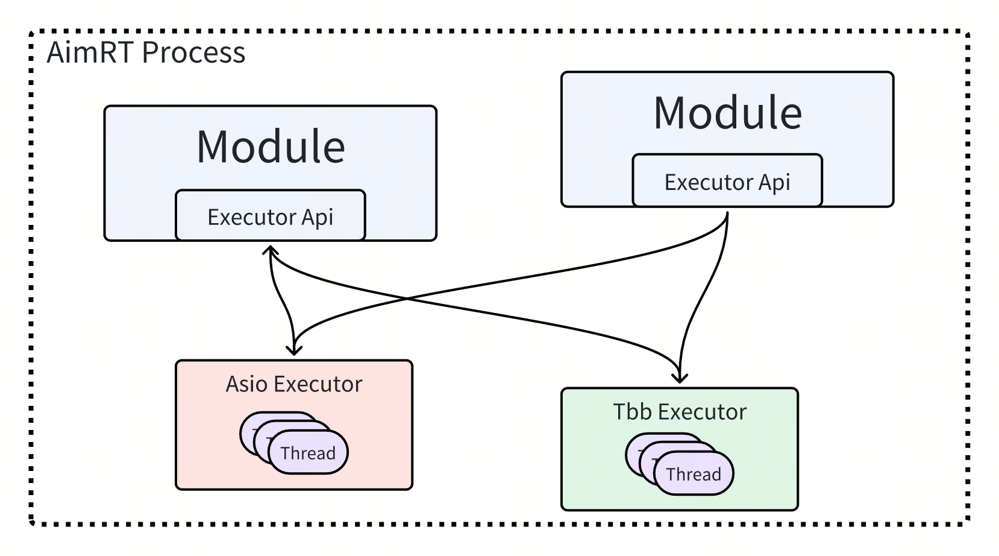

# 基本概念


## AimRT框架包含的内容

参考AimRT源码中的src目录，AimRT框架中包含的内容如下：
```
src
├── common ------------------------------- // 一些基础的、可以直接使用的通用组件，例如string、log接口、buffer等
├── examples ----------------------------- // AimRT官方示例
│   ├── cpp ------------------------------ // CPP接口的示例
│   ├── py ------------------------------- // Python接口的示例
│   └── plugins -------------------------- // 一些各方插件的使用示例
├── interface ---------------------------- // AimRT接口层
│   ├── aimrt_core_plugin_interface ------ // [CPP] 插件开发接口
│   ├── aimrt_module_c_interface --------- // [C] 模块开发接口
│   ├── aimrt_module_cpp_interface ------- // [CPP] 模块开发接口，对C版本的封装
│   ├── aimrt_module_protobuf_interface -- // [CPP] 与protobuf相关的模块开发接口，基于CPP版本接口
│   ├── aimrt_module_ros2_interface ------ // [CPP] 与ROS2相关的模块开发接口，基于CPP版本接口
│   └── aimrt_pkg_c_interface ------------ // [C] Pkg开发接口
├── plugins ------------------------------ // AimRT官方插件
├── protocols ---------------------------- // 一些AimRT官方的标准协议
├── runtime ------------------------------ // AimRT运行时
│   ├── core ----------------------------- // 运行时核心库
│   ├── main ----------------------------- // 基于core实现的一个主进程"aimrt_main"
│   └── python_runtime ------------------- // 基于pybind11封装的python版本运行时
└── tools -------------------------------- // 一些配套工具
```

## AimRT中的"Module"概念
与大多数框架一样，AimRT拥有一个用于标识独立逻辑单元的概念：`Module`。`Module`是一个逻辑层面的概念，代表一个逻辑上内聚的块。`Module`之间可以在逻辑层通过`Channel`和`RPC`两种抽象的接口通信。可以通过实现几个简单的接口来创建一个`Module`。

一个`Module`通常对应一个硬件抽象、或者是一个独立算法、一项业务功能。`Module`可以使用框架提供的句柄来调用各项运行时功能，例如配置、日志、执行器等。框架给每个`Module`提供的句柄也是独立的，来实现一些资源统计、管理方面的功能。

## AimRT中的"Node"概念
`Node`代表一个可以部署启动的进程，在其中运行了一个AimRT框架的Runtime实例。`Node`是一个部署、运行层面的概念，一个`Node`中可能存在多个`Module`。`Node`在启动时可以通过配置文件来设置日志、插件、执行器等运行参数。

## AimRT中的"Pkg"概念
`Pkg`是AimRT框架运行`Module`的一种途径。`Pkg`代表一个包含了单个或多个`Module`的动态库，`Node`在运行时可以加载一个或多个`Pkg`。可以通过实现几个简单的模块描述接口来创建`Pkg`。

`Module`的概念更侧重于代码逻辑层面，而`Pkg`则是一个部署层面的概念，其中不包含业务逻辑代码。一般来说，在可以兼容的情况下，推荐将多个`Module`编译在一个`Pkg`中，这种情况下使用RPC、Channel等功能时性能会有优化。

通常`Pkg`中的符号都是默认隐藏的，只暴露有限的纯C接口，不同`Pkg`之间不会有符号上的相互干扰。不同`Pkg`理论上可以使用不同版本的编译器独立编译，不同`Pkg`里的`Module`也可以使用相互冲突的第三方依赖，最终编译出的`Pkg`可以二进制发布。


## AimRT框架集成业务逻辑的两种方式
AimRT框架可以通过两种方式来集成业务逻辑，分别是**App模式**和**Pkg模式**，实际采用哪种方式需要根据具体场景进行判断。两者的区别如下：
- **App模式**：在开发者自己的Main函数中直接链接AimRT运行时库，编译时直接将业务逻辑代码编译进主程序：
  - **优势**：没有dlopen这个步骤，没有so，只会有最终一个exe。
  - **劣势**：可能会有第三方库的冲突；无法独立的发布`Module`，想要二进制发布只能直接发布exe。
- **Pkg模式**：使用AimRT提供的**aimrt_main**可执行程序，在运行时根据配置文件加载动态库形式的`Pkg`，导入其中的`Module`类:
  - **优势**：编译业务`Module`时只需要链接非常轻量的AimRT接口层，不需要链接AimRT运行时库；可以二进制发布so；独立性较好。
  - **劣势**：框架基于dlopen加载`Pkg`，极少数场景下会有一些兼容性问题。

无论采用哪种方式都不影响业务逻辑，且两种方式可以共存，也可以很简单的进行切换，实际采用哪种方式需要根据具体场景进行判断。

注意，上述说的两种方式只是针对Cpp开发接口。如果是使用Python开发，则只支持**App模式**。

## AimRT中的"Protocol"概念
`Protocol`意为协议，代表`Module`之间通信的数据格式，用来描述数据的字段信息以及序列化、反序列化方式，例如`Channel`的订阅者和发布者之间制定的数据格式、或者`RPC`客户端和服务端之间制定的请求包/回包的数据格式。通常由一种`IDL`(Interface description language)描述，然后由某种工具转换为各个语言的代码。

AimRT目前官方支持两种IDL：
- Protobuf
- ROS2 msg/srv

但AimRT并不限定协议与IDL的具体类型，使用者可以实现其他的IDL，例如Thrift IDL、FlatBuffers等，甚至支持一些自定义的IDL。

## AimRT中的"Channel"概念
`Channel`也叫数据通道，是一种典型的通信拓补概念，其通过`Topic`标识单个数据通道，由发布者`Publisher`和订阅者`Subscriber`组成，订阅者可以获取到发布者发布的数据。`Channel`是一种多对多的拓补结构，`Module`可以向任意数量的`Topic`发布数据，同时可以订阅任意数量的`Topic`。类似的概念如ROS中的Topic、Kafka/RabbitMQ等消息队列。


在AimRT中，Channel由`接口层`和`后端`两部分组成，两者相互解耦。接口层定义了一层抽象的Api，表示逻辑层面上的`Channel`；而后端负责实际的Channel数据传输，可以有多种类型。AimRT官方提供了一些Channel后端，例如mqtt、ros等，使用者也可以自行开发新的Channel后端。

开发者在使用AimRT中的Channel功能时，先在业务逻辑层调用接口层的API，往某个Topic中发布数据，或订阅某个Topic的数据。然后AimRT框架会根据一定的规则，选择一个或几个Channel后端进行处理，这些后端将数据通过一些特定的方式发送给其他节点，由其他节点上对应的Channel后端接收数据并传递给业务逻辑层。整个逻辑流程如下图所示：




## AimRT中的"Rpc"概念
`RPC`也叫远程过程调用，基于请求-回复模型，由客户端`Client`和服务端`Server`组成，`Module`可以创建客户端句柄，发起特定的RPC请求，由其指定的、或由框架根据一定规则指定的服务端来接收请求并回复。`Module`也可以创建服务端句柄，提供特定的RPC服务，接收处理系统路由过来的请求并回复。类似的概念如ROS中的Services、GRPC/Thrift等RPC框架。

在AimRT中，RPC也由`接口层`和`后端`两部分组成，两者相互解耦。接口层定义了RPC的抽象Api，而后端则负责实际的RPC调用。AimRT官方提供了一些RPC后端，例如http、ros等，使用者也可以自行开发新的RPC后端。

开发者使用AimRT的RPC功能时，先在业务逻辑层调用接口层API，通过Client发起一个RPC调用，AimRT框架会根据一定的规则选择一个RPC后端进行处理，它将数据通过一些特定的方式发送给Server节点，由Server节点上对应的Rpc后端接收数据并传递给业务层，并将业务层的回包传递回Client端。整个逻辑流程如下图所示：




## AimRT中的"Executor"概念
`Executor`，或者叫执行器，是指一个可以运行任务的抽象概念，一个执行器可以是一个Fiber、Thread或者Thread Pool，我们平常写的代码也是默认的直接指定了一个执行器：Main线程。一般来说，能提供以下接口的就可以算是一个执行器：
```cpp
void Execute(std::function<void()>&& task);
```

还有一种`Executor`提供定时执行的功能，可以指定在某个时间点或某段时间之后再执行任务。其接口类似如下：
```cpp
void ExecuteAt(std::chrono::system_clock::time_point tp, std::function<void()>&& task);
void ExecuteAfter(std::chrono::nanoseconds dt, std::function<void()>&& task);
```


在AimRT中，执行器功能由`接口层`和`实际执行器的实现`两部分组成，两者相互解耦。接口层定义了执行器的抽象Api，提供投递任务的接口。而实现层则负责实际的任务执行，根据实现类型的不同有不一样的表现。AimRT官方提供了几种执行器，例如基于Asio的线程池、基于Tbb的无锁线程池、基于时间轮的定时执行器等。

开发者使用AimRT的执行器功能时，在业务层将任务打包成一个闭包，然后调用接口层的API，将任务投递到具体的执行器内，而执行器会根据自己的调度策略，在一定时机执行投递过来的任务。具体逻辑流程如下图所示：




## AimRT中的"Plugin"概念
`Plugin`指插件，是指一个可以向AimRT框架注册各种自定义功能的动态库，可以被框架运行时加载，或在用户自定义的可执行程序中通过硬编码的方式注册到框架中。AimRT框架暴露了大量插接点和查询接口，例如：
- 日志后端注册接口
- Channel/Rpc后端注册接口
- Channel/Rpc注册表查询接口
- 各组件启动hook点
- RPC/Channel调用过滤器
- 模块信息查询接口
- 执行器注册接口
- 执行器查询接口
- ......


使用者可以直接使用一些AimRT官方提供的插件，也可以从第三方开发者处寻求一些插件，或者自行实现一些插件以增强框架的服务能力，满足特定需求。

