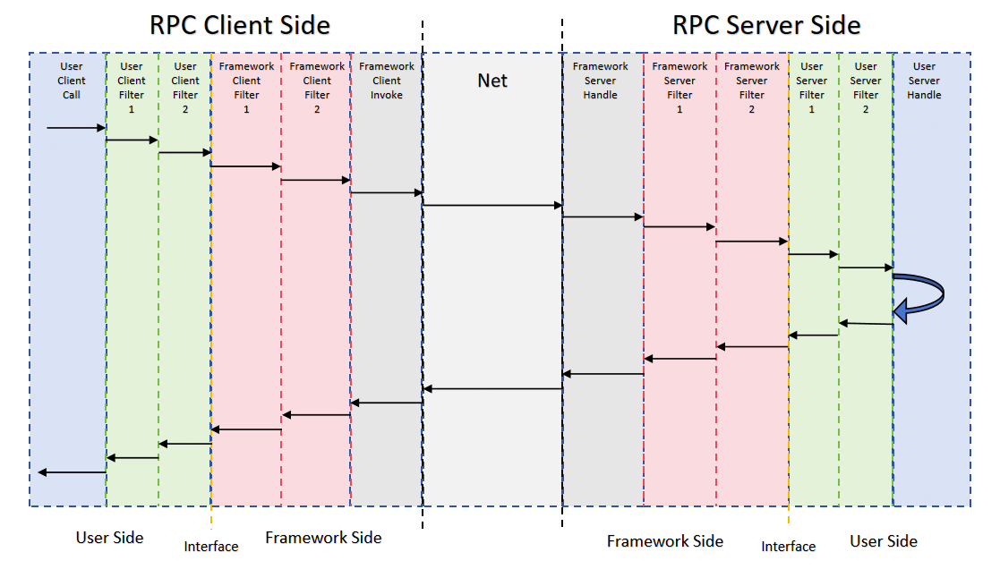
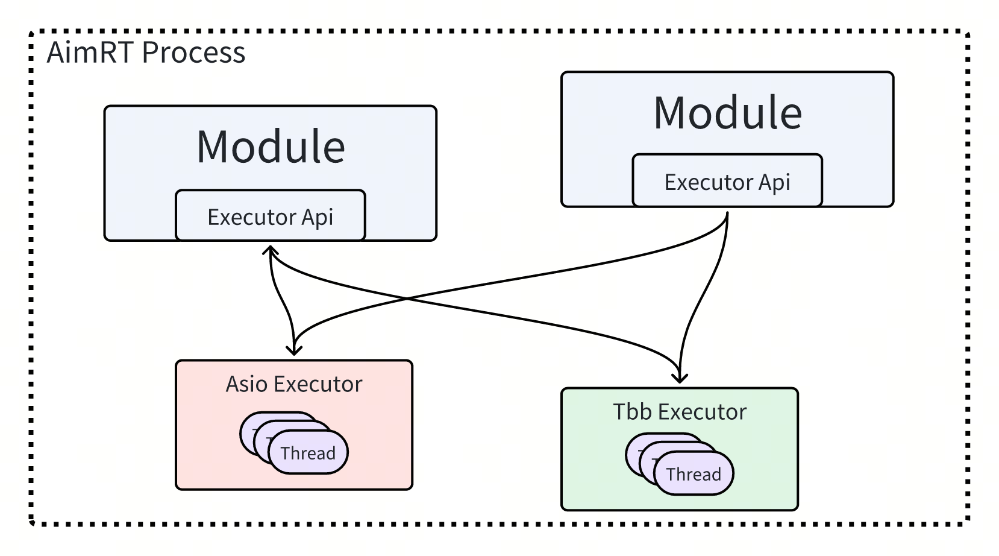

# AimRT 中的基本概念


## AimRT 框架包含的内容

参考 AimRT 源码中的 src 目录，AimRT 框架中包含的内容如下：
```
src
├── common --------------------------------- // 一些基础的、可以直接使用的通用组件，例如 string、log 接口、buffer 等
├── examples ------------------------------- // AimRT 官方示例
│   ├── cpp -------------------------------- // CPP 接口的示例
│   ├── py --------------------------------- // Python 接口的示例
│   └── plugins ---------------------------- // 一些各方插件的使用示例
├── interface ------------------------------ // AimRT 接口层
│   ├── aimrt_core_plugin_interface -------- // [CPP] 插件开发接口
│   ├── aimrt_module_c_interface ----------- // [C] 模块开发接口
│   ├── aimrt_module_cpp_interface --------- // [CPP] 模块开发接口，对 C 版本的封装
│   ├── aimrt_module_protobuf_interface ---- // [CPP] 与 protobuf 相关的模块开发接口，基于 CPP 版本接口
│   ├── aimrt_module_ros2_interface -------- // [CPP] 与 ROS2 相关的模块开发接口，基于 CPP 版本接口
│   ├── aimrt_pkg_c_interface -------------- // [C] Pkg 开发接口
│   └── aimrt_type_support_pkg_c_interface - // [C] Type support 包接口
├── plugins -------------------------------- // AimRT 官方插件
├── protocols ------------------------------ // 一些 AimRT 官方的标准协议
├── runtime -------------------------------- // AimRT 运行时
│   ├── core ------------------------------- // 运行时核心库
│   ├── main ------------------------------- // 基于 core 实现的一个主进程"aimrt_main"
│   └── python_runtime --------------------- // 基于 pybind11 封装的 python 版本运行时
└── tools ---------------------------------- // 一些配套工具
```

## AimRT 中的 "Module" 概念
与大多数框架一样，AimRT 拥有一个用于标识独立逻辑单元的概念：`Module`。`Module`是一个逻辑层面的概念，代表一个逻辑上内聚的块。`Module`之间可以在逻辑层通过`Channel`和`RPC`两种抽象的接口通信。可以通过实现几个简单的接口来创建一个`Module`。

一个`Module`通常对应一个硬件抽象、或者是一个独立算法、一项业务功能。`Module`可以使用框架提供的句柄来调用各项运行时功能，例如配置、日志、执行器等。框架给每个`Module`提供的句柄也是独立的，来实现一些资源统计、管理方面的功能。

## AimRT 中的 "Node" 概念
`Node`代表一个可以部署启动的进程，在其中运行了一个 AimRT 框架的 Runtime 实例。`Node`是一个部署、运行层面的概念，一个`Node`中可能存在多个`Module`。`Node`在启动时可以通过配置文件来设置日志、插件、执行器等运行参数。

## AimRT 中的 "Pkg" 概念
`Pkg`是 AimRT 框架运行`Module`的一种途径。`Pkg`代表一个包含了单个或多个`Module`的动态库，`Node`在运行时可以加载一个或多个`Pkg`。可以通过实现几个简单的模块描述接口来创建`Pkg`。

`Module`的概念更侧重于代码逻辑层面，而`Pkg`则是一个部署层面的概念，其中不包含业务逻辑代码。一般来说，在可以兼容的情况下，推荐将多个`Module`编译在一个`Pkg`中，这种情况下使用 RPC、Channel 等功能时性能会有优化。

通常`Pkg`中的符号都是默认隐藏的，只暴露有限的纯 C 接口，不同`Pkg`之间不会有符号上的相互干扰。不同`Pkg`理论上可以使用不同版本的编译器独立编译，不同`Pkg`里的`Module`也可以使用相互冲突的第三方依赖，最终编译出的`Pkg`可以二进制发布。


## AimRT 框架集成业务逻辑的两种方式
AimRT 框架可以通过两种方式来集成业务逻辑，分别是 **App模式** 和 **Pkg模式**，实际采用哪种方式需要根据具体场景进行判断。两者的区别如下：
- **App模式**：在开发者自己的 Main 函数中直接链接 AimRT 运行时库，编译时直接将业务逻辑代码编译进主程序：
  - **优势**：没有 dlopen 这个步骤，没有 so，只会有最终一个 exe。
  - **劣势**：可能会有第三方库的冲突；无法独立的发布`Module`，想要二进制发布只能直接发布 exe。
  - **使用场景**：一般用于小工具、小型 Demo 场景，没有太大的模块解耦需求；
- **Pkg模式**：使用 AimRT 提供的 **aimrt_main** 可执行程序，在运行时根据配置文件加载动态库形式的`Pkg`，导入其中的`Module`类:
  - **优势**：编译业务`Module`时只需要链接非常轻量的 AimRT 接口层，不需要链接 AimRT 运行时库；可以二进制发布 so；独立性较好。
  - **劣势**：框架基于 dlopen 加载`Pkg`，极少数场景下会有一些兼容性问题。
  - **使用场景**：一般用于中大型项目，对模块解耦、二进制发布等有较强烈需求时；

无论采用哪种方式都不影响业务逻辑，且两种方式可以共存，实际采用哪种方式需要根据具体场景进行判断。

注意，上述说的两种方式只是针对 Cpp 开发接口。如果是使用 Python 开发，则只支持**App模式**。


## AimRT 中的 "Protocol" 概念
`Protocol`意为协议，代表`Module`之间通信的数据格式，用来描述数据的字段信息以及序列化、反序列化方式，例如`Channel`的订阅者和发布者之间制定的数据格式、或者`RPC`客户端和服务端之间制定的请求包/回包的数据格式。通常由一种`IDL`( Interface description language )描述，然后由某种工具转换为各个语言的代码。

AimRT 目前官方支持两种 IDL：
- Protobuf
- ROS2 msg/srv

但 AimRT 并不限定协议与IDL的具体类型，使用者可以实现其他的 IDL，例如 Thrift IDL、FlatBuffers 等，甚至支持一些自定义的 IDL。


## AimRT 中的 "Channel" 概念
`Channel`也叫数据通道，是一种典型的通信拓补概念，其通过`Topic`标识单个数据通道，由发布者`Publisher`和订阅者`Subscriber`组成，订阅者可以获取到发布者发布的数据。`Channel`是一种多对多的拓补结构，`Module`可以向任意数量的`Topic`发布数据，同时可以订阅任意数量的`Topic`。类似的概念如 ROS 中的 Topic、Kafka/RabbitMQ 等消息队列。


在 AimRT 中，Channel 由`接口层`和`后端`两部分组成，两者相互解耦。接口层定义了一层抽象的 Api，表示逻辑层面上的`Channel`；而后端负责实际的 Channel 数据传输，可以有多种类型。AimRT 官方提供了一些 Channel 后端，例如 mqtt、ros 等，使用者也可以自行开发新的 Channel 后端。

开发者在使用 AimRT 中的 Channel 功能时，先在业务逻辑层调用接口层的 API，往某个 Topic 中发布数据，或订阅某个 Topic 的数据。然后 AimRT 框架会根据一定的规则，选择一个或几个 Channel 后端进行处理，这些后端将数据通过一些特定的方式发送给其他节点，由其他节点上对应的 Channel 后端接收数据并传递给业务逻辑层。整个逻辑流程如下图所示：


## AimRT 中的 "Rpc" 概念
`RPC`也叫远程过程调用，基于请求-回复模型，由客户端`Client`和服务端`Server`组成，`Module`可以创建客户端句柄，发起特定的 RPC 请求，由其指定的、或由框架根据一定规则指定的服务端来接收请求并回复。`Module`也可以创建服务端句柄，提供特定的 RPC 服务，接收处理系统路由过来的请求并回复。类似的概念如 ROS 中的 Services、GRPC/Thrift 等 RPC 框架。

在 AimRT 中，RPC 也由`接口层`和`后端`两部分组成，两者相互解耦。接口层定义了 RPC 的抽象 Api，而后端则负责实际的 RPC 调用。AimRT 官方提供了一些 RPC 后端，例如 http、ros 等，使用者也可以自行开发新的 RPC 后端。

开发者使用 AimRT 的 RPC 功能时，先在业务逻辑层调用接口层 API，通过 Client 发起一个 RPC 调用，AimRT 框架会根据一定的规则选择一个 RPC 后端进行处理，它将数据通过一些特定的方式发送给 Server 节点，由 Server 节点上对应的 Rpc 后端接收数据并传递给业务层，并将业务层的回包传递回 Client 端。整个逻辑流程如下图所示：


## AimRT 中的 "Filter" 概念
AimRT 中提供了`Filter`功能，用以增强 RPC 或 Channel 的能力。Filter 是一层贴着 Interface 层的、用户可自定义的逻辑插接点，按照相对于 Interface 层的位置，分为框架侧 Filter（Framework Filter）和用户侧 Filter（User Filter）。按照服务的功能，又分为 RPC Filter 和 Channel Filter。


Filter 在 RPC 或 Channel 每次被调用时触发，以一种类似洋葱的运行结构，在 RPC 或 Channel 调用前后做一些自定义动作，例如计算耗时、上报监控等。以 RPC Filter 为例，其运行时流程如下图所示：





## AimRT 中的 "Executor" 概念
`Executor`，或者叫执行器，是指一个可以运行任务的抽象概念，一个执行器可以是一个 Fiber、Thread 或者 Thread Pool，我们平常写的代码也是默认的直接指定了一个执行器：Main 线程。一般来说，能提供以下接口的就可以算是一个执行器：
```cpp
void Execute(std::function<void()>&& task);
```

还有一种`Executor`提供定时执行的功能，可以指定在某个时间点或某段时间之后再执行任务。其接口类似如下：
```cpp
void ExecuteAt(std::chrono::system_clock::time_point tp, std::function<void()>&& task);
void ExecuteAfter(std::chrono::nanoseconds dt, std::function<void()>&& task);
```


在 AimRT 中，执行器功能由**接口层**和**实际执行器的实现**两部分组成，两者相互解耦。接口层定义了执行器的抽象 Api，提供投递任务的接口。而实现层则负责实际的任务执行，根据实现类型的不同有不一样的表现。AimRT 官方提供了几种执行器，例如基于 Asio 的线程池、基于 Tbb 的无锁线程池、基于时间轮的定时执行器等。

开发者使用 AimRT 的执行器功能时，在业务层将任务打包成一个闭包，然后调用接口层的 API，将任务投递到具体的执行器内，而执行器会根据自己的调度策略，在一定时机执行投递过来的任务。具体逻辑流程如下图所示：




## AimRT 中的 "Plugin" 概念
`Plugin`指插件，是指一个可以向 AimRT 框架注册各种自定义功能的动态库，可以被框架运行时加载，或在用户自定义的可执行程序中通过硬编码的方式注册到框架中。AimRT 框架暴露了大量插接点和查询接口，例如：
- 日志后端注册接口
- Channel/Rpc 后端注册接口
- Channel/Rpc 注册表查询接口
- 各组件启动 hook 点
- RPC/Channel 调用过滤器
- 模块信息查询接口
- 执行器注册接口
- 执行器查询接口
- ......


使用者可以直接使用一些 AimRT 官方提供的插件，也可以从第三方开发者处寻求一些插件，或者自行实现一些插件以增强框架的服务能力，满足特定需求。

