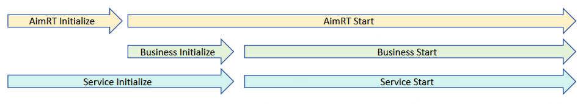

# 核心设计理念

## Initialize阶段和Start阶段

在大部分领域，一个常驻型服务的运行过程通常分为两个阶段：
- **初始化阶段**：进行一些冗长的的初始化逻辑，只占整个运行过程的最开始一小段，在初始化成功后就进入阶段二；
- **运行阶段**：进行循环的、高效的任务处理，会占据大部分的运行时间，直到进程因为某些原因被停止；

根据这两个阶段的特点可以发现，保障**运行阶段**的执行效率更为重要，而**初始化阶段**的执行效率则相对不是太重要。

AimRT根据这个理论前提，将整个运行时间分为`Initialize`阶段和`Start`阶段，在`Initialize`阶段尽可能的将所有运行时需要的资源都申请、注册、初始化完毕，尽量保证在`Start`阶段没有额外的资源申请、注册表加锁等操作，从而优化运行阶段效率。具体到AimRT使用时，表现为有一些接口只能在`Initialize`阶段调用，而另一些接口只能在`Start`阶段调用。

需要注意的是，AimRT的`Initialize`阶段仅仅是AimRT框架自身的初始化阶段，可能只是整个服务**初始化阶段**的一部分。使用者可能还需要在AimRT的`Start`阶段先初始化自己的一些业务逻辑，比如检查上下游资源、进行一些配置等，然后再真正的进入整个服务的**运行阶段**。各个运行阶段关系如下图所示：

## 逻辑实现与部署运行分离
AimRT的一个重要设计思想是：将逻辑开发与实际部署运行解耦。开发者在实现具体业务逻辑时，也就是写`Module`代码时，可以不用关心最终运行时的**部署方式**、**通信方式**。例如：在开发一个RPC client模块和一个RPC server模块时，用户只需要知道client发出去的请求，server一定能接收到并进行处理，而不用关心最终client模块和server模块部署在哪里、以及client和server端数据是怎么通信的。如下图所示：

当用户开发完成后，再根据实际情况决定部署、通信方案。例如：
- 如果两个模块可以编译在一起，则client-server之间的通信可以直接传递数据指针。
- 如果后续两个模块需要进行稳定性解耦，则可以部署为同一台服务器上的两个进程，client-server之间通过共享内存、本地回环等方式进行通信。
- 如果发现其中一个模块需要部署在机器人端，另一个需要部署在云端，则client-server之间可以通过http、tcp等方式进行通信。

而这些变化只需要用户修改配置、或简单修改Pkg、Main函数中的一些代码即可支持，不用修改任何原始的逻辑代码。

## 兼容第三方生态
AimRT的底层通信是交给插件来执行的，也可以借此实现一些兼容第三方生态的功能。例如当`Module`通过`Channel`对外发布一个消息时，插件层可以将其编码为一个ROS2消息并发送到原生ROS2体系中，从而打通与原生ROS2节点的互通。并且AimRT底层可以加载多个插件，因此可以同时兼容不同的第三方生态。如下图所示：

