# AimRT 性能测试

## 序言
AimRT 的通信层由插件实现，官方支持 iceoryx、ROS2、Zenoh、Http、Grpc、Mqtt 等通信插件，覆盖常见的端、云通信场景。这些插件可提供发布-订阅（如 Channel）和请求-响应（如 Rpc）两种常见的通信模式以实现本机和跨机的进程间通信。

## 测试条目
- 单机性能测试
  - 日志性能测试
  - Channel 后端性能测试
  - Rpc 后端性能测试
- 多机性能测试
  - Channel 后端性能测试
  - Rpc后端性能测试

## 测试环境
| 架构  | 操作系统  | 系统架构 |                        CPU                        |
| :---: | :-------: | :------: | :-----------------------------------------------: |
| 主机1 | GNU/Linux |  x86_64  | 13th Gen Intel(R) Core(TM) i5-1350P   - CPU(s):16 |
| 主机2 | GNU/Linux |  x86_64  | 13th Gen Intel(R) Core(TM) i5-1350P   - CPU(s):16 |

## 测试结果

### 单机性能测试

#### 日志性能测试
  - 测试环境：主机1·x86 (3核)
  - 测试目的：单机Logger性能测试（平均时延 VS 日志尺寸）
  - 测试配置：channel_frequency=1 kHz,  pkg_size=1 k bytes
  - 测试结果：
  
   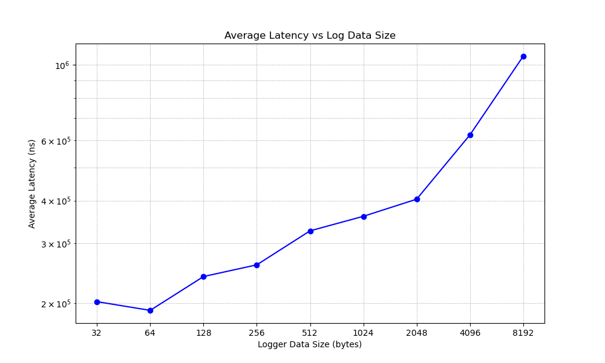

  - 汇总：
  
| epoch num | log data size (bytes) | total duration (us) | avg latency (ns) | Avg CPU Usage  (%) | Max CPU Usage  (%) |
| :-------: | :----------------------: | :--------------------: | :-----------------: | :-------------------: | :-------------------: |
|  100000   |            32            |      20224916791       |       202249        |          1.5          |          2.0          |
|  100000   |            64            |      19069532154       |       190695        |          1.9          |          2.3          |
|  100000   |           128            |      23960396974       |       239603        |          2.0          |          2.7          |
|  100000   |           256            |      25929815751       |       259298        |          2.1          |          2.3          |
|  100000   |           512            |      32619783334       |       326197        |          2.0          |          2.2          |
|  100000   |           1024           |      35979578403       |       359795        |          2.2          |          2.4          |
|  100000   |           2048           |      40387963437       |       403879        |          2.1          |          2.3          |
|  100000   |           4096           |      62327675334       |       623276        |          2.3          |          2.7          |
|  100000   |           8192           |      105983512645      |       1059835       |          2.5          |          2.9          |

#### Channel 后端性能测试
- 测试条目1：
  - 测试环境：主机1·x86 (3核)
  - 测试目的：单机跨进程 Channel 后端通信测试（平均时延 VS 包尺寸）
  - 测试配置：channel_frequency=1 kHz,  topic_number=1
  - 测试结果：
  
  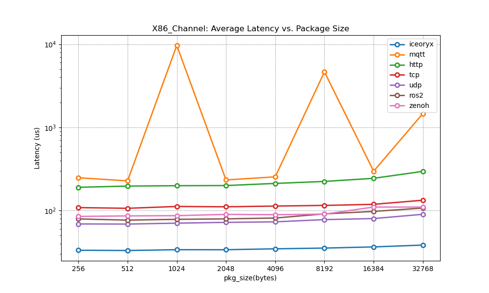
  

- 测试条目2：
  - 测试环境：主机1·x86 (3核)
  - 测试目的：单机跨进程 Channel 后端通信测试（平均时延 VS 话题数）
  - 测试配置：channel_frequency=1 kHz,  pkg_size=1 k bytes
  - 测试结果：
  
   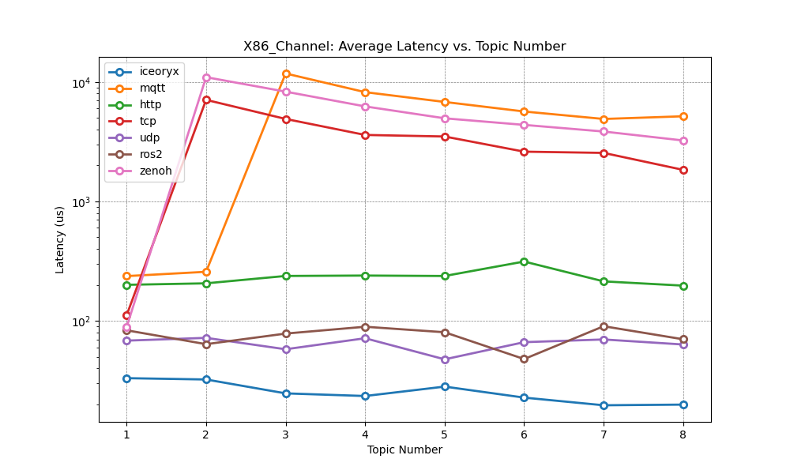

- 汇总：
  
| ID  | Backend Type | Pkg Size  (bytes) | Topic num | Avg Latency  (us) | Max Latency  (us) | Loss Rate  (%) | Avg CPU Usage  (%) |
| --- | ------------ | :------------------: | :-------: | :------------------: | :------------------: | :---------------: | :-------------------: |
| 1   | iceoryx      |         512          |     1     |        33.78         |       556.791        |         0         |        0.8/0.1        |
| 2   | ros2         |         512          |     1     |        78.294        |        601.76        |         0         |        3.1/1.2        |
| 3   | zenoh        |         512          |     1     |        86.67         |       3479.172       |         0         |        0.9/0.3        |
| 4   | iceoryx      |         2048         |     1     |        33.755        |       368.843        |         0         |        0.9/0.3        |
| 5   | ros2         |         2048         |     1     |        78.294        |        601.76        |         0         |        3.5/3.3        |
| 6   | zenoh        |         2048         |     1     |        89.812        |       2265.741       |         0         |        1.3/1.4        |
| 4   | iceoryx      |         8192         |     1     |        35.327        |       372.595        |         0         |        1.0/0.4        |
| 5   | ros2         |         8192         |     1     |        91.106        |       898.042        |         0         |        3.6/4.2        |
| 6   | zenoh        |         8192         |     1     |        90.438        |       1222.726       |         0         |       2.0 /1.5        |
| 4   | iceoryx      |         1024         |     1     |        33.108        |        325.33        |         0         |       0.9 /0.8        |
| 5   | ros2         |         1024         |     1     |        83.337        |       1223.164       |         0         |        3.4/3.2        |
| 6   | zenoh        |         1024         |     1     |        88.695        |       1208.31        |         0         |        1.7/1.4        |
| 4   | iceoryx      |         1024         |     4     |        23.417        |       458.296        |         0         |        1.5/1.5        |
| 5   | ros2         |         1024         |     4     |        89.216        |       1965.28        |         0         |       4.4/ 11.7       |
| 6   | zenoh        |         1024         |     4     |       6243.743       |      12750.598       |         0         |        2.5/1.6        |
| 4   | iceoryx      |         1024         |     8     |        19.884        |       320.847        |         0         |        2.8/2.1        |
| 5   | ros2         |         1024         |     8     |        70.075        |       3913.944       |         0         |       7.5/13.6        |
| 6   | zenoh        |         1024         |     8     |       3237.104       |       6913.596       |         0         |       3.0 /1.8        |

#### Rpc 后端性能测试
- 测试条目1：
  - 测试环境：主机 1·x86 (3核)
  - 测试目的：单机跨进程 Rpc 后端通信测试（平均时延 VS 数据包尺寸）
  - 测试配置：paraller_number=1 
  - 测试结果：
  
   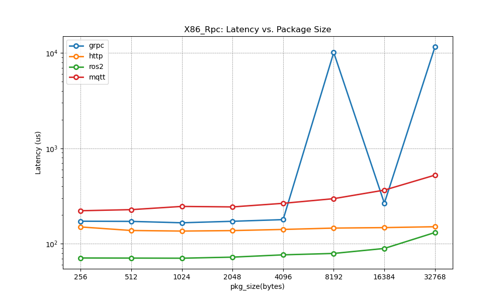

- 测试条目2：
  - 测试环境：主机1·x86 (3核)
  - 测试目的：单机跨进程 Rpc 后端通信测试（平均时延 VS 并行数）
  - 测试配置：Rpc_frequency=1 kHz, pkg_size=1 k bytes
  - 测试结果：

   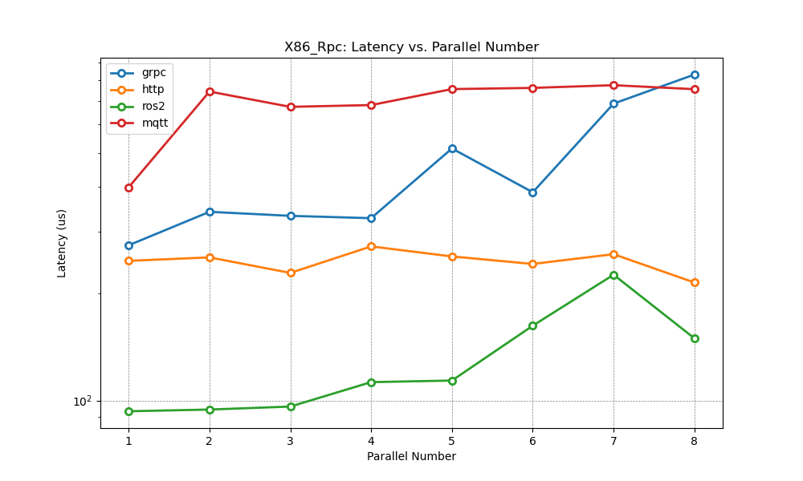
  

-  测试条目3：
  - 测试环境：主机1·x86 (3核)
  - 测试目的：单机跨进程Rpc后端通信测试（QPS VS 数据包尺寸）
  - 测试配置: paraller_number=1 
  - 测试结果：

   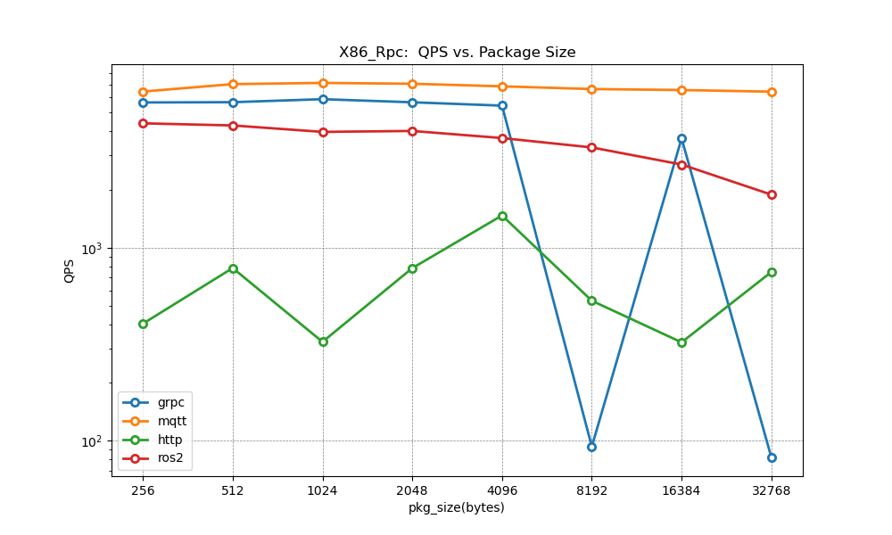

 - 汇总

 | ID  | Backend Type | Pkg Size  (bytes) | Topic num | Avg Latency  (us) | Max Latency  (us) |   QPS    | Loss Rate  (%) | Avg CPU Usage  (%) |
 | --- | ------------ | :------------------: | :-------: | :------------------: | :------------------: | :------: | :---------------: | :-------------------: |
 | 1   | grpc         |         512          |     1     |       102.385        |       1015.132       | 5668.934 |         0         |       11.2/6.6        |
 | 2   | http         |         512          |     1     |       137.783        |       646.192        | 7032.348 |         0         |       33.9/6.9        |
 | 3   | ros2         |         512          |     1     |       710.772        |       787.366        | 784.190  |      0.00038      |       23.1/4.1        |
 | 3   | mqtt         |         512          |     1     |       227.804        |      99936.432       | 4295.532 |         0         |       13.4/2.3        |
 | 1   | grpc         |         2048         |     1     |       172.007        |       846.916        | 5662.514 |         0         |       21.4/4.4        |
 | 2   | http         |         2048         |     1     |       137.435        |       620.138        | 7062.146 |         0         |       47.5/14.8       |
 | 3   | ros2         |         2048         |     1     |        72.425        |       687.575        | 783.330  |      0.00036      |       28.4/7.7        |
 | 3   | mqtt         |         2048         |     1     |       243.326        |      100343.387      | 4022.526 |         0         |       18.6/6.1        |
 | 1   | grpc         |         8096         |     1     |      10117.553       |      42523.423       |  93.248  |      0.00014      |       26.2/4.8        |
 | 2   | http         |         8096         |     1     |        145.98        |       747.248        | 6631.299 |         0         |       49.0/18.7       |
 | 3   | ros2         |         8096         |     1     |        79.177        |        554.62        | 530.898  |      0.00058      |       34.4/8.5        |
 | 3   | mqtt         |         8096         |     1     |       296.979        |      100546.137      | 3304.692 |         0         |       20.1/7.8        |
 | 1   | grpc         |         1024         |     1     |       274.102        |       1135.26        |    -     |         0         |       28.7/7.3        |
 | 2   | http         |         1024         |     1     |       253.347        |       916.773        |    -     |         0         |       44.3/16.8       |
 | 3   | ros2         |         1024         |     1     |        93.259        |       1081.053       |    -     |      0.00138      |       27.3/6.2        |
 | 3   | mqtt         |         1024         |     1     |       399.444        |      100581.09       |    -     |         0         |       17.5/11.1       |
 | 1   | grpc         |         1024         |     4     |       326.857        |       3131.102       |    -     |         0         |       19.8/12.6       |
 | 2   | http         |         1024         |     4     |       272.115        |       1713.79        |    -     |         0         |       46.3/26.3       |
 | 3   | ros2         |         1024         |     4     |       112.685        |       2050.94        |    -     |      0.0011       |       40.6/19.6       |
 | 3   | mqtt         |         1024         |     4     |       681.431        |      99994.365       |    -     |         0         |       26.0/14.0       |
 | 1   | grpc         |         1024         |     8     |       830.776        |       4318.728       |    -     |         0         |       31.1/16.6       |
 | 2   | http         |         1024         |     8     |       215.188        |       3961.397       |    -     |         0         |       51.2/29.9       |
 | 3   | ros2         |         1024         |     8     |       149.772        |       3380.315       |    -     |      0.0001       |       41.1/20.2       |
 | 3   | mqtt         |         1024         |     8     |       755.568        |      98599.196       |    -     |         0         |       28.8/15.2       |

### 多机性能测试

#### 主机1 to 主机2  Channel 后端性能测试

- 测试条目1：
  - 测试环境：主机1·x86 (3核), 主机2·x86 (3核)
  - 测试目的：跨机跨进程 Channel 后端通信测试（平均时延 VS 包尺寸）
  - 测试配置：channel_frequency=1 kHz,  topic_number=1
  - 测试结果：

   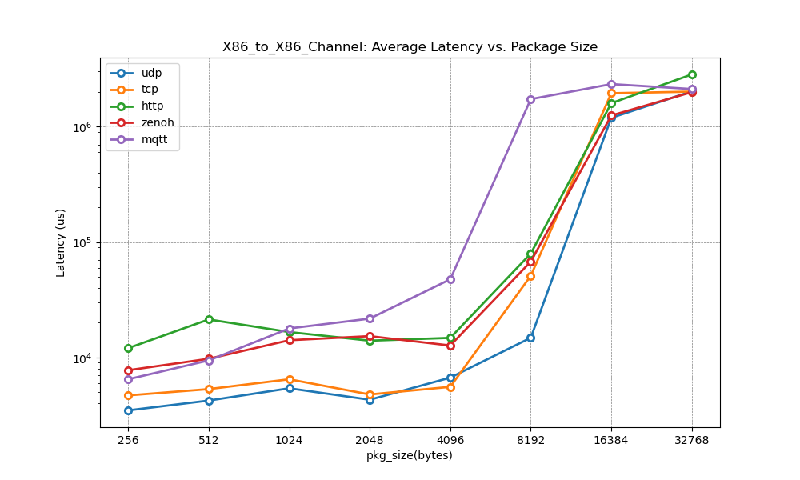

- 测试条目2：
  - 测试环境：主机1·x86 (3核), 主机2·x86 (3核)
  - 测试目的：跨机跨进程 Channel 后端通信测试（平均时延 VS 话题数）
  - 测试配置：channel_frequency=1 kHz,  pkg_size=1 k bytes
  - 测试结果：
  
   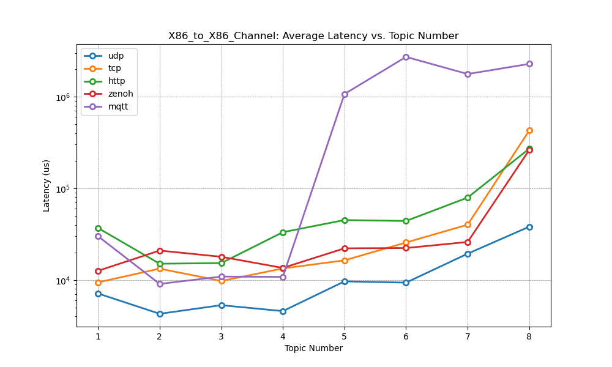

- 汇总：
  
| ID  | Backend Type | Pkg Size  (bytes) | Topic num | Avg Latency  (us) | Max Latency  (us) | Loss Rate  (%) |
| --- | ------------ | :------------------: | :-------: | :------------------: | :------------------: | :---------------: |
| 1   | mqtt         |         512          |     1     |       9436.628       |     1922348.666      |         0         |
| 3   | zenoh        |         512          |     1     |       9749.743       |      225513.208      |         0         |
| 1   | mqtt         |         2048         |     1     |      21715.483       |      87612.922       |         0         |
| 3   | zenoh        |         2048         |     1     |      15313.238       |      130844.909      |         0         |
| 1   | mqtt         |         8096         |     1     |     1728639.372      |     4060503.312      |         0         |
| 3   | zenoh        |         8096         |     1     |      67700.703       |       84407.91       |         0         |
| 1   | mqtt         |         1024         |     1     |       30003.15       |      143020.411      |         0         |
| 3   | zenoh        |         1024         |     1     |      12590.826       |      78070.239       |         0         |
| 1   | mqtt         |         1024         |     4     |      10815.251       |      109914.215      |         0         |
| 3   | zenoh        |         1024         |     4     |      13537.918       |      98343.269       |         0         |
| 1   | mqtt         |         1024         |     8     |     2281671.772      |     4289304.104      |         0         |
| 3   | zenoh        |         1024         |     8     |      262563.641      |      449324.47       |         0         |

#### 主机1 to 主机2  Rpc 后端性能测试

- 测试条目1：
  - 测试环境：主机1·x86 (3核), 主机2·x86 (3核)
  - 测试目的：x86_to_X86 跨机跨进程 Rpc 后端通信测试（平均时延 VS 数据包尺寸）
  - 测试配置：paraller_number=1 
  - 测试结果：
  
   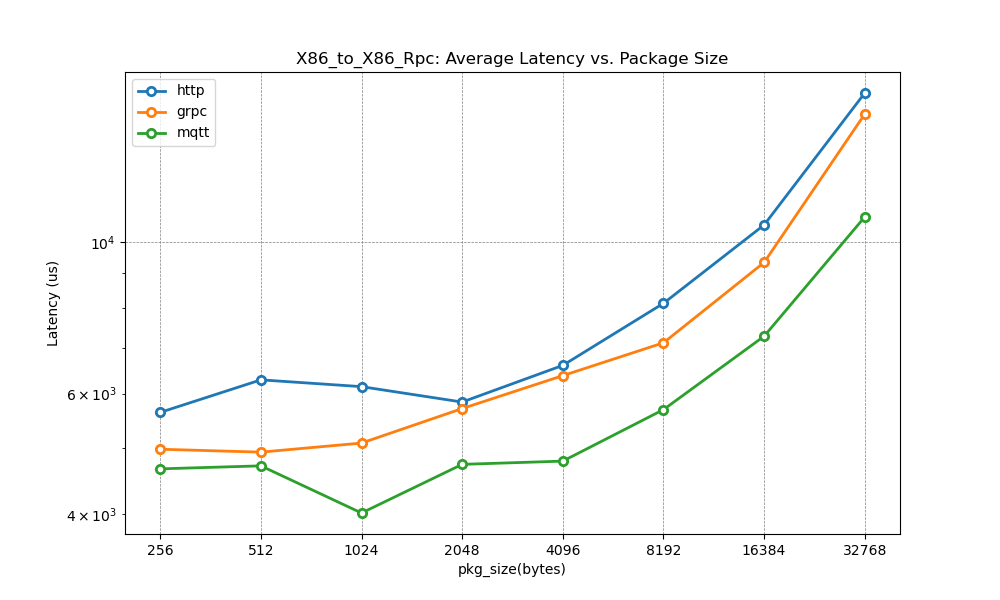

- 测试条目2：
  - 测试环境：主机1·x86 (3核), 主机2·x86 (3核)
  - 测试目的：x86_to_X86 跨机跨进程 Rpc 后端通信测试（平均时延 VS 并行数）
  - 测试配置：Rpc_frequency=1 kHz,  pkg_size=1 k bytes
  - 测试结果：

   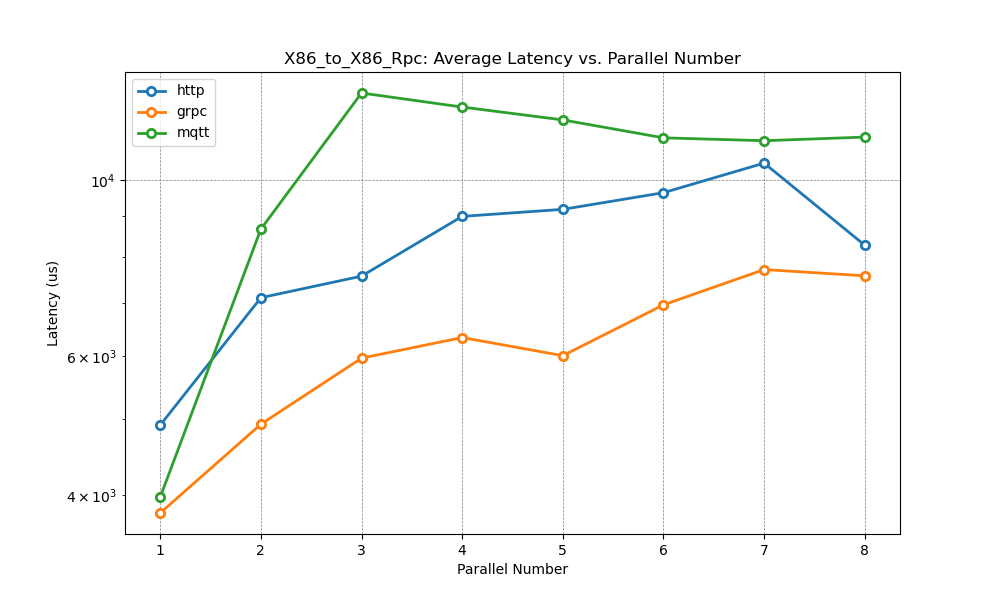

- 测试条目3：
  - 测试环境：主机1·x86 (3核), 主机2·x86 (3核)
  - 测试目的：x86_to_X86 跨机跨进程 Rpc 后端通信测试（QPS VS 数据包尺寸）
  - 测试配置：paraller_number=1 
  - 测试结果：

   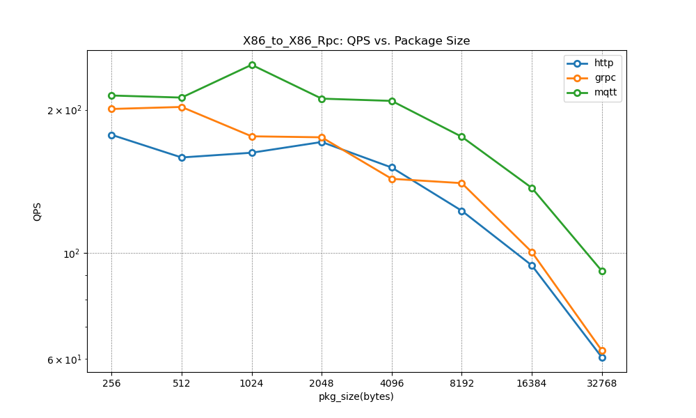

- 汇总

 | ID  | Backend Type | Pkg Size  (bytes) | Topic num | Avg Latency  (us) | Max Latency  (us) |   QPS   | Loss Rate  (%) |
 | --- | ------------ | :------------------: | :-------: | :------------------: | :------------------: | :-----: | :---------------: |
 | 1   | grpc         |         512          |     1     |       4924.824       |      322766.91       | 202.741 |         0         |
 | 2   | http         |         512          |     1     |       6284.018       |      324016.359      | 158.825 |         0         |
 | 3   | mqtt         |         512          |     1     |       4702.392       |      320198.678      | 212.116 |         0         |
 | 1   | grpc         |         2048         |     1     |       5704.31        |      403065.412      | 175.082 |         0         |
 | 2   | http         |         2048         |     1     |       5830.839       |      222680.914      | 171.156 |         0         |
 | 3   | mqtt         |         2048         |     1     |       4726.14        |      321514.163      | 211.041 |         0         |
 | 1   | grpc         |         8096         |     1     |       7120.05        |      315765.656      | 140.295 |         0         |
 | 2   | http         |         8096         |     1     |       8134.13        |      335106.68       | 122.756 |         0         |
 | 3   | mqtt         |         8096         |     1     |       5684.013       |      165831.057      | 175.530 |         0         |
 | 1   | grpc         |         1024         |     1     |       3800.001       |      83298.271       |    -    |         0         |
 | 2   | http         |         1024         |     1     |       4906.788       |      238306.281      |    -    |         0         |
 | 3   | mqtt         |         1024         |     1     |       3979.662       |      117279.111      |    -    |         0         |
 | 1   | grpc         |         1024         |     4     |       6329.525       |      315825.548      |    -    |         0         |
 | 2   | http         |         1024         |     4     |       9002.289       |      614524.388      |    -    |         0         |
 | 3   | mqtt         |         1024         |     4     |      12371.313       |      327013.301      |    -    |         0         |
 | 1   | grpc         |         1024         |     8     |       7574.52        |      881297.081      |    -    |         0         |
 | 2   | http         |         1024         |     8     |       8278.314       |      904195.888      |    -    |         0         |
 | 3   | mqtt         |         1024         |     8     |      11336.935       |      324605.52       |    -    |         0         |

