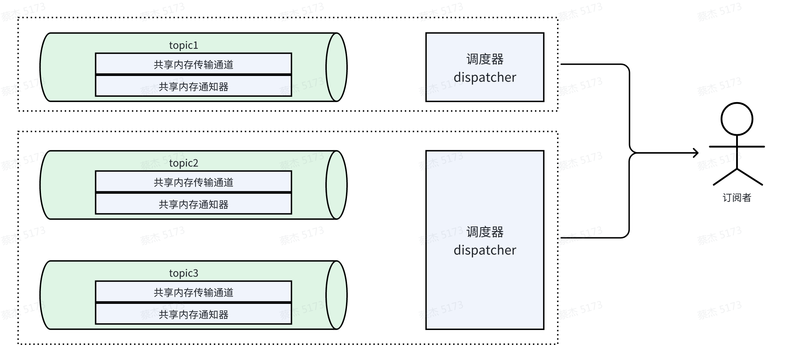
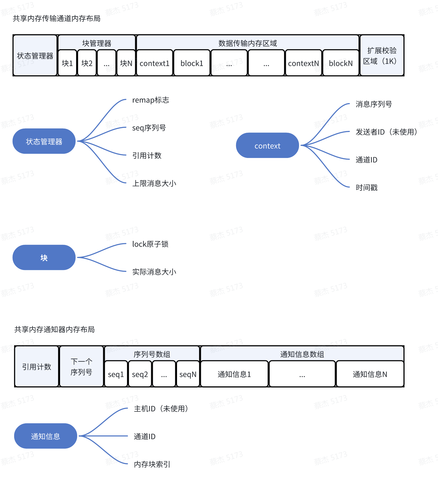

# 共享内存插件


***TODO待完善***

## 代码结构
- sm_plugin
  - dispatcher：调度器，负责监听共享内存中可读状态，在读取数据后执行用户callback。
  - notifier：通知器，用于多进程/多线程间的通知，在共享内存发生写事件后通知到读者，可支持多种通知方式，如shm、组播等。
  - segment：共享内存底层管理，包含资源、状态、内存块、上下文等管理，无锁实现共享内存管理，支持自动扩容。
  - shm：共享内存跨平台的实现，支持XSI、POSIX共享内存。
  - transmitter：发射器，负责将用户数据写到共享内存上并发出通知。

## 资源使用
1. 在共享内存插件的设计上，每个TOPIC会包括2个实际的共享内存块同时在工作：
    - 共享内存传输通道
    - 共享内存通知器

    


2. 对于订阅者可为每个TOPIC配置专用的调度器，也可将多个TOPIC放在同一个调度器上使用（需要为每个调度器分配AIMRT执行器资源）。

    


3. 在节点正常退出时，会将共享内存上的引用计数减1，直至所有节点都未使用共享内存时，将共享内存销毁，如果是异常退出时，则可能出现无法正常减少引用计数的情况，系统将残留共享内存文件。

## 共享内存资源布局

  

## 动态扩容机制

默认情况下，发布者创建的共享内存每个block的大小是16k，而当发布者需要发布大于16K点数据时，会进行扩容处理，扩容的逻辑如下：

  

对订阅者来说，触发扩容后，会重映射共享内存块，并重新更新所管理的共享内存大小、内存块大小等资源信息。

## 无锁设计
共享内存上的内存块管理均使用原子操作，相对于使用mutex更轻量。
- 写操作流程如下：
  1. 上层尝试获取可写内存块：`TryAcquireBlockForWrite(size, &writable_block)`
  2. 从状态管理器上自增seq后，找到获取到可用的block索引： `status_manager_->FetchAddSeq(1) % block_count`
  3. 从块管理器上尝试将lock锁住用于写操作，如果不成功则重复步骤b，直至成功，成功后返回可用的block索引。
  4. 记录访问对应索引的block与context。
  5. 内存地址的合法性校验：`LegalityCheck(writable_block->buf)`
  6. 返回可写块给上层。
  7. 上层写完后释放可写块：`ReleaseWriteBlock(writable_block)`
- 读操作流程如下：
  1. 上层通过通知器获取到可读块的索引信息：`TryAcquireBlockForRead(&readable_block)`
  2. 尝试将可读块以读方式锁住（支持多读）：`blocks_[index].TryLockForRead()`
  3. 然后根据可读块的索引访问具体的context与block。
  4. 读取数据完成后释放可读块：`ReleaseReadBlock(readable_block)`

## 冗余安全设计（待实现）
- 读写过程中出现异常崩溃时，可能会导致原子锁未能释放，以至于写者无法再次覆写该block，后续可考虑使用超时机制，当持有锁时间超过一定期限时，释放该锁。或者记录使用者的PID信息，通过系统查询进程是否存活，如果不存活则释放锁。
- 共享内存的引用计数问题：如果进程异常退出后，可能引起共享内存残留在系统中，可引入第三方监测节点（守护进程）进行清理共享内存。


## 共享内存插件使用

1. 在plugin配置中添加共享内存插件，如下：

    ```yaml
    plugin:
      plugins:
        - name: sm_plugin
          path: ./libaimrt_sm_plugin.so
    ```

   - name: 插件名称，必须为sm_plugin
   - path: 插件路径，必须为./libaimrt_sm_plugin.so

2. 订阅共享内存topic配置，在channel中添加共享内存后端，如下：

    ```yaml
    channel: # 消息队列相关配置
      backends: # 消息队列后端配置
        - type: sm
        options:
          sub_default_executor: sm_default_thread_pool # 默认执行器
          sub_topic_options:
            - topic_name: '^[\w/#+-]+$' # 支持正则表达式，所有topic
              executor: sm_default_thread_pool # 指定执行器
              priority: 10 # 优先级
    ```

    - type: 后端类型，必须为sm
    - sub_default_executor: 默认执行器，对订阅者是必选配置，必须与执行器配置中的name一致。
    - sub_topic_options: 订阅topic的配置信息
      - 订阅者topic配置，用于配置订阅者需要订阅的topic信息，支持正则表达式，如上配置表示订阅所有topic，也可配置为具体的topic名称，**但不支持为空**。
      - executor: 执行器名称，可选配置，如果不配置则使用默认执行器。
      - priority: 优先级，可选配置，如果不配置则使用默认优先级，优先级数字越小，优先级越高，默认优先级为`std::numeric_limits<int32_t>::max()`。

3. 发布共享内存topic配置，在channel中添加共享内存后端，如下：

    ```yaml
    channel: # 消息队列相关配置
      backends: # 消息队列后端配置
        - type: sm
        options:
          passable_pub_topics:
            - '^[\w/#+-]+$'
          unpassable_pub_topics:
            - '/abc'
            - '/def'
    ```
    - type: 后端类型，必须为sm
    - passable_pub_topics: 可发布topic配置，支持正则表达式，如上配置表示可发布所有topic，也可配置为具体的topic名称，**支持为空，如果为空则表示不发布任何topic**。
    - unpassable_pub_topics: 不可发布topic配置，支持正则表达式，也可配置为具体的topic名称如上配置表示不可发布`/abc`、`/def`的topic，**支持为空**。


