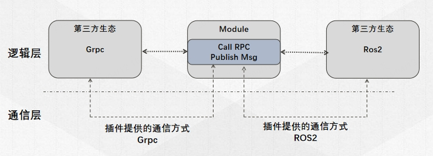

# Core Design Philosophy of AimRT

## Initialize Phase and Start Phase

In most domains, the operation process of a persistent service typically consists of two phases:
- **Initialization phase**: Performs lengthy initialization logic, occupying only the very beginning of the entire operation process. Upon successful initialization, it enters the runtime phase;
- **Runtime phase**: Performs cyclic, efficient task processing, occupying most of the operation time until the process is stopped for some reason;

Given the characteristics of these two phases, it becomes evident that ensuring the execution efficiency of the **runtime phase** is more crucial, while the execution efficiency of the **initialization phase** is relatively less important.

Based on this theoretical premise, AimRT divides the entire runtime into `Initialize` phase and `Start` phase. During the `Initialize` phase, it strives to allocate, register, and initialize all required runtime resources in advance, ensuring minimal resource allocation, registry locking, or similar operations during the `Start` phase, thereby optimizing runtime efficiency.

Concretely in AimRT usage, this manifests as some interfaces being callable only during the `Initialize` phase, while others are restricted to the `Start` phase. Meanwhile, AimRT guarantees that the `Initialize` phase executes single-threaded, reducing developers' burden on thread safety considerations. Additionally, after `Initialize` completion, AimRT can explicitly identify required resources and communication relationships, generating an initialization report. Developers can view this report in logs or export it through parameters/interfaces.

It should be noted that AimRT's `Initialize` phase only represents the framework's own initialization phase, which may constitute just part of the service's **entire initialization phase**. Users might need to initialize their own business logic during AimRT's `Start` phase first, such as checking upstream/downstream resources or performing configuration tasks, before truly entering the service's **runtime phase**. The relationships between phases are shown in the following diagram:

## Decoupling Logical Implementation from Deployment Execution

A key design philosophy of AimRT is: decouple logical development from actual deployment execution. When implementing specific business logic (i.e., writing `Module` code), developers don't need to consider final runtime **deployment methods** or **communication protocols**. For example, when developing an RPC client module and an RPC server module, users only need to ensure that requests sent by the client will be received and processed by the server, without worrying about final deployment locations or data communication mechanisms between client and server. As shown below:

After completing development, users can determine deployment and communication solutions based on actual requirements. For example:
- If two modules can be compiled together, client-server communication can directly pass data pointers.
- If subsequent stability decoupling is required, modules can be deployed as separate processes on the same server, communicating via shared memory or local loopback.
- If one module needs deployment on a robot and another in the cloud, client-server communication can use HTTP or TCP protocols.

These changes only require users to modify configurations or make minor adjustments in Pkg/Main function code, without altering any original logic code.

## Thread Resources in AimRT

AimRT advocates allocating all required resources during initialization, including thread resources. Generally, threads in an AimRT process originate from four sources:
- Threads launched by AimRT framework itself;
- Threads explicitly configured in user startup files;
- Threads started by plugins loaded by AimRT framework;
- Threads created by users in business modules;

The first two belong to framework-managed threads, the third to plugin-managed threads, and the last to user-managed threads.

Without any configuration or plugins, AimRT framework itself uses only two threads:
- **Main thread**: The thread calling AimRT `Initialize` and `Start` methods, typically the `main` function thread. After startup, AimRT usually blocks the main thread waiting for shutdown signals to invoke `Shutdown`.
- **Daemon thread**: AimRT launches a daemon thread to periodically monitor runtime status, issue warnings for prolonged blocking, and serve as the default logging thread.

If users configure executors in startup files, AimRT will create corresponding threads or thread pools during initialization for business operations. Developers are recommended to use framework-managed thread resources rather than manually creating threads. For specific usage, refer to executor documentation.

Additionally, threads introduced by plugins should refer to respective plugin documentation. Users can also freely use native thread APIs to create their own thread resources in business code.

## Third-Party Ecosystem Compatibility

AimRT's underlying communication is handled by plugins, enabling compatibility with third-party ecosystems. For example, when a `Module` publishes a message via `Channel`, the plugin layer could encode it as a ROS2 message and publish it to native ROS2 systems, achieving interoperability with ROS2 nodes. Since AimRT can load multiple plugins simultaneously, it supports compatibility with different third-party ecosystems concurrently. As shown below: