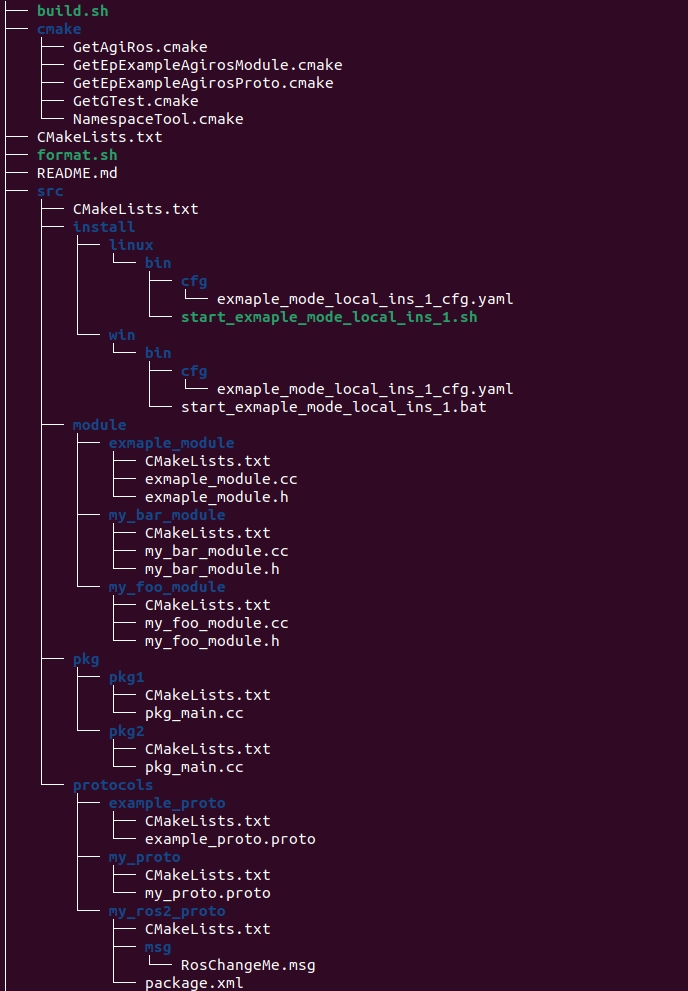

# CLI工具

## 1. 简介

**aimrt_cli**是一个命令行工具，目前支持以下功能：

+ 自动化生成代码，详细指引: [自动化生成指南](#3-代码自动化生成指南)

## 2. 安装与使用
**aimrt_cli**工具有以下三种安装方式。请选择任意一种您喜欢的进行安装

### 2.1 从Release中下载可执行文件
您可在[Release下载地址](https://code.agibot.com/agibot-tech/aimrt/-/releases)中找到所需的发布版本，
将其下载后解压，并将其加入到系统的环境变量中，请执行以下流程：
```
vim ~/.bashrc
add or modify "export PATH=<path_to_your_aimrt_cli>:$PATH"
source ~/.bashrc
```
即可在终端中执行 `aimrt_cli`命令

### 2.2 源码安装到python环境中
**aimrt_cli**提供了通过 `setuptools`工具直接打包到python环境中的功能，
您可在终端中执行:
```
cd <path_to_your_aimrt_src_code>/src/tools/aimrt_cli
python setup.py install
```
aimrt_cli工具将会自动安装到您的python环境中。
使用 `pip list | grep aimrt_cli`可查看是否安装成功。
可使用 `pip uninstall aimrt_cli`进行卸载。

### 2.3 源码编译出可执行文件
可直接通过编译**aimrt**库编译出 `aimrt_cli`的可执行文件，
并通过[安装方式一](#21-从release中下载可执行文件)添加环境变量的方式将编译出的可执行文件添加到系统的环境变量中。
编译流程为:
+ 执行您aimrt源码库中的build.sh文件。
+ 在build文件夹下可找到编译出的aimrt_cli可执行文件。
+ 将其添加到环境变量中。


## 3. 代码自动化生成指南
### 3.1 简介
**aimrt_cli**可根据配置的yaml文件，通过执行命令自动化生成出所需的工程文件。

基本的使用样例如下：
```
aimrt_cli gen -p [your_required_configuration].yaml -o [your_required_output_folder]
```

您也可以使用 `aimrt_cli -h/--help`查看支持的命令行选项。

### 3.2 配置文件解读
代码库在 `aimrt_cli` 文件夹下给出了一个配置文件示例 `configuration_example.yaml`。

这里对其进行解读:

#### 3.2.1 基础信息的配置
```
# 基础信息
base_info:
  project_name: test_prj
  build_mode_tags: ["EXAMPLE", "SIMULATION", "TEST_CAMERA"] # 构建模式标签
  aimrt_import_options: # 引入aimrt时的一些选型
    AIMRT_BUILD_RUNTIME: 'ON'
    AIMRT_USE_FMT_LIB: 'ON'
    AIMRT_BUILD_WITH_PROTOBUF: 'ON' # 注意引号是必须的，否则pyyaml会将其解析为True
    AIMRT_USE_LOCAL_PROTOC_COMPILER: 'OFF'
    AIMRT_USE_PROTOC_PYTHON_PLUGIN: 'OFF'
    AIMRT_BUILD_WITH_ROS2: 'ON'
    # ...
```
`base_info`是配置文件的必配项，这里指定了一些您所需工程的基本信息，其中:
+ `project_name`是您工程的名称，也是代码出来的namespace名称。
+ `build_mode_tags`是您可自定义的一些编译选项，如果没有需要自定义的选项，请将其置为空列表。请注意编译选项生成格式为`{PROJECT_NAME}_{OPTION_NAME}`
+ `aimrt_import_options`是引入aimrt自带的编译选项配置，注意此处的编译选项必须是aimrt中的，如果定义错了将会报错。

注意pyyaml会直接将yaml文件的ON解析为True，所以在yaml文件中指定option参数时需要加上单引号。

#### 3.2.2 依赖的标准模块的配置：
```
# 依赖的标准模块
depends_std_modules:
  - name: ep-example-aimrt-module
    git_repository: http://code.agibot.com/agi-ep/ep-example-aimrt-module.git
    git_tag: v0.1.5
    import_options:
      XXX: 'ON'
  - name: ep-example-aimrt-protocols
    git_repository: http://code.agibot.com/agi-ep/ep-example-aimrt-proto.git
    git_tag: v0.1.11
  # - name: xxx
  #   git_repository: http://xxx/xxx.git
  #   git_tag: v1.x.x
```
此处，您可指定您的工程依赖的一些外部的标准模块，
`depends_std_modules`不是必备项， 如不需要可将其删除或者内容置为空。
+ `name`选项为依赖的标准模块名，名称应和需要拉去的库名称一致，否则按拉取库的名称为准。
+ `git_repository` 为依赖库地址。
+ `git_tag` 为需要拉取的库版本。
+ `import_options` 为导入选项，暂不支持。

#### 3.2.3 协议配置：
```
# 协议
protocols:
  - name: my_proto
    type: protobuf
    options:
      xxx: xxx
  - name: my_ros2_proto
    type: ros2
    options:
      zzz: zzz
    build_mode_tag: ["EXAMPLE"]
  - name: example_proto
    type: protobuf
    build_mode_tag: ["EXAMPLE"] #仅在EXAMPLE模式为true时构建。build_mode_tag未设置则表示默认在所有模式下都构建
```
此处，您可自定义您在工程中所需用到的协议内容与类型，
代码生成工具会根据此处配置生成对应的协议模块， 
`protocols`不是必备项， 如不需要可将其删除或者内容置为空。
+ `name`是您所需定义的数据协议名。
+ `type`是您定义的协议所属的种类，分为`protobuf`以及`ros2`两种类型，分别生成对应的协议模块。
+ `options`是可选参数，暂不支持。
+ `build_mode_tag`是此协议的编译选项，只有在编译中指定了此选项，此协议才会被编译。不指定则默认编译。

请注意，协议配置只会一句配置内容生成对应的协议模块，请在生成的模块文件中，自定义好您所需的数据类型。

#### 3.2.4 模块配置
```
# 模块
modules:
  - name: my_foo_module
  - name: my_bar_module
  - name: exmaple_module
    build_mode_tag: ["EXAMPLE"]
    options:
      aaa: aaa
```
此处可配置您工程中所需自定义的模块， `modules`不是必配项。
代码生成工具将根据您的配置，生成一个包含 `<module_name>.cc, <module_name>.h, CMakeLists.txt`的标准模块模板。
您之后根据需求对其进行修改开发。
+ `name`是您所需定义的模块名。
+ `build_mode_tag`是此模块的编译选项，只有在编译中指定了此选项，此模块才会被编译。不指定则默认编译。
+ `options`是可选参数，暂不支持。

#### 3.2.5 模块包配置
```
# pkg
pkgs:
  - name: pkg1
    modules:
      - name: my_foo_module
        namespace: local
      - name: my_bar_module
        namespace: local
    options:
      sss: sss
  - name: pkg2
    modules:
      - name: exmaple_module
        namespace: local
      - name: ep_example_bar_module
        namespace: ep_example_aimrt_module
    build_mode_tag: ["EXAMPLE"]
    options:
      sss: sss
```
模块包在aimrt中定义为模块的集合，并且是部署的最小单元。`pkgs`不是必配项。
此处会进行检查模块是否存在，检测仅针对于自定义模块。
如果是识别不到的外部模块，会报warning提醒，并由用户自己保证。
+ `name`是您所需定义的模块包名。
+ `modules`是关联到此模块包中的模块。
  + 子项 `name`指的是关联的模块名
  + 子项 `namespace`指的是模块所处的命名空间名称，如果是关联自定义模块应设为`local`，若是外部模块则应设为其所在的命名空间名称。
+ `build_mode_tag`是此模块包的编译选项，只有在编译中指定了此选项，此模块包才会被编译。不指定则默认编译。
+ `options`是可选参数，暂不支持。

#### 3.2.6 部署配置
```
# 部署
deploy_modes:
  - name: exmaple_mode
    build_mode_tag: ["EXAMPLE"]
    deploy_ins:
      - name: local_ins_1
        pkgs:
          - name: pkg1
            options:
              disable_module: []
      - name: local_ins_2
      - name: remote_ins_123

  - name: deploy_mode_1
  - name: deploy_mode_2
```
此处用来指定您工程的部署配置，您将再次告诉模块包该如何部署运行。`deploy_modes`不是必配项。
其中:
+ `name`是您所需定义的部署类名称。
+ `build_mode_tag`是此类部署对应的编译选项，此选项在此进行起到一个检查的作用，只有其关联的pkgs为默认生成或者满足相同编译选项，才可生效。
+ `deploy_ins`是具体的部署配置：
  + 子项 `name`指定具体部署的名称。
  + 子项 `pkgs` 自定部署依赖的模块包的名称，这将会在自动生成部署配置文件时将模块关联的动态库关联过去。注意如果没有配置任何的模块包将不会生成具体的部署配置。
  + 子项 `pkgs` 下还可以配置 `options`标签，目前 `options`支持配置 `disable_module`选项，该选项可指定在此部署下pkg中不会包含的module模块名。在运行时，这些模块将不会被加载。

注意，代码自动生成工具，给予部署配置生成的具体部署的配置文件中并没有为关联的模块生成具体配置项，需要您自己指定。

最终将在指定的目录中生成具体的工程， `configuration_example.yaml`生成的工程结构如下：



