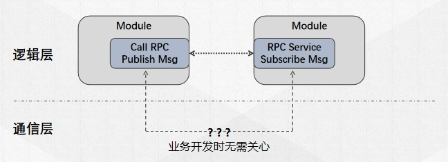

# 基本概念

[TOC]

## `AimRT`框架包含的内容

&emsp;&emsp;参考[src](https://code.agibot.com/agibot_aima/aimrt/-/tree/main/src)下的目录，`AimRT`框架中包含的内容如下：
- **common**: 一些基础的、可以直接使用的通用组件，例如string、log接口、buffer等；
- **interface**: `AimRT`接口层；
  - **aimrt_module_c_interface**： `Module`开发接口，C版本；
  - **aimrt_module_cpp_interface**： `Module`开发接口，CPP版本，对C版本的封装；
  - **aimrt_module_ros2_interface**： `Module`开发接口，与ROS2相关的部分，基于CPP版本接口；
  - **aimrt_module_protobuf_interface**: `Module`开发接口，与protobuf相关的部分，基于CPP版本接口；
  - **aimrt_pkg_c_interface**: `Pkg`开发接口，C版本；
  - **aimrt_core_plugin_interface**: 插件开发接口；
- **runtime**: `AimRT`运行时；
  - **core**: 运行时核心库；
  - **main**: 基于core实现的一个主进程`aimrt_main`；
  - **python_runtime**: 基于pybind11封装的python版本运行时；
- **plugins**: `AimRT`官方插件；
  - **lcm_plugin**: Lcm插件；
  - **mqtt_plugin**: MQTT插件；
  - **net_plugin**: Net插件；
  - **parameter_plugin**: Parameter插件；
  - **record_playback_plugin**: 录播插件；
  - **ros2_plugin**: ROS2 Humble插件；
  - **sm_plugin**: 共享内存插件；
  - **time_manipulator_plugin**: 时间控制器插件；
- **protocols**: 一些`AimRT`官方的标准协议；
- **examples**: 示例
  - **cpp**: 基于CPP版本`Module`接口开发的相关示例；
  - **python**: 基于Python版本`Module`接口开发的相关示例；
  - **plugins**: 一些各方插件的使用示例；
- **tools**: 一些配套工具；

## `AimRT`中的`Module`概念
&emsp;&emsp;与大多数框架一样，AimRT拥有一个用于标识独立逻辑单元的概念：`Module`。`Module`是一个逻辑层面的概念，代表一个逻辑上内聚的类。`Module`之间可以在逻辑层通信，主要的逻辑层通信接口有两种：`Channel`、`RPC`。可以将`Module`看作一个对外提供一定接口的黑盒。

&emsp;&emsp;`Module`通过实现几个简单的模块接口来创建。一个`Module`通常对应一个硬件抽象，或者是一个独立算法、一项业务功能。`Module`可以使用框架提供的各项运行时功能，例如配置、日志、执行器等。

## `AimRT`中的`Node`概念
&emsp;&emsp;`Node`代表一个可以部署启动的进程，在其中运行了一个`AimRT`框架的Runtime实例。`Node`是一个部署、运行层面的概念，一个`Node`中可能存在多个`Module`。`Node`在启动时可以通过配置文件来设置日志、插件、执行器等运行参数。

## `AimRT`中的`Pkg`概念
&emsp;&emsp;`Pkg`是`AimRT`框架运行`Module`的一种途径。`Pkg`代表一个包含了单个或多个`Module`的动态库，`Node`在运行时可以加载一个或多个`Pkg`。`Pkg`通过实现几个简单的模块描述接口来创建，一个`Pkg`中可以有多个`Module`。相比于`Pkg`，`Module`的概念更侧重于代码层面，而`Pkg`则是一个部署层面的概念，其中不包含业务逻辑代码。一般来说，在可以互相兼容的情况下，推荐将多个`Module`编译在一个`Pkg`中，这种情况下使用RPC、Channel等功能时性能会有优化。

&emsp;&emsp;一般来说，`Pkg`中的符号都是默认隐藏的，只暴露有限的纯C接口，不同`Pkg`之间不会有符号上的相互干扰。不同`Pkg`理论上可以使用不同版本的编译器独立编译，不同`Pkg`里的`Module`也可以使用相互冲突的第三方依赖版本进行编译，最终编译出的`Pkg`可以二进制发布。


## `AimRT`框架加载`Moduel`的两种方式
&emsp;&emsp;`AimRT`框架可以通过两种方式来加载、运行`Module`，其优势劣势如下，实际采用哪种方式需要根据具体场景进行判断：
- **App模式**：在开发者自己的Main函数中硬编码注册各个模块，编译时直接将各个业务`Module`类编译进主程序：
  - 优势：没有dlopen这个步骤，没有so，只会有最终一个exe。
  - 劣势：可能会有第三方库的冲突；无法独立的发布`Module`，想要二进制发布只能直接发布exe。
- **Pkg模式**：使用AimRT提供的**aimrt_main**可执行程序，在运行时根据配置文件加载动态库形式的`Pkg`，导入其中的`Module`类:
  - 优势：编译业务`Module`时只需要链接非常轻量的接口层，不需要链接运行时库；可以二进制发布so；独立性较好。
  - 劣势：框架基于dlopen加载`Pkg`，极少数场景下会有一些兼容性问题。

&emsp;&emsp;无论采用哪种方式都不影响业务逻辑，且两种方式可以共存，也可以很简单的进行切换，实际采用哪种方式需要根据具体场景进行判断。

&emsp;&emsp;注意，上述说的两种方式只是针对Cpp模块。如果是Python模块，则只支持通过Python代码硬编码注册这种**App模式**。

## `AimRT`中的`Protocol`概念
&emsp;&emsp;`Protocol`意为协议，代表`Module`之间通信的数据格式，用来描述数据的字段信息以及序列化、反序列化方式，例如`Channel`的订阅者和发布者之间制定的数据格式、或者`RPC`客户端和服务端之间制定的请求包/回包的数据格式。通常由一种`IDL`(Interface description language)描述，然后由某种工具转换为各个语言的代码。

&emsp;&emsp;`AimRT`目前官方支持两种IDL：
- Protobuf
- ROS2 msg/srv

&emsp;&emsp;但`AimRT`并不限定协议与IDL的具体类型，使用者可以实现其他的IDL，例如Thrift IDL、FlatBuffers等，甚至支持一些自定义的IDL。

## `AimRT`中的`Channel`概念
&emsp;&emsp;`Channel`也叫数据通道，是一种典型的通信拓补概念，其通过`Topic`标识单个数据通道，由发布者`Publisher`和订阅者`Subscriber`组成，订阅者可以获取到发布者发布的数据。`Channel`是一种多对多的拓补结构，`Module`可以向任意数量的`Topic`发布数据，同时可以订阅任意数量的`Topic`。类似的概念如ROS中的Topic、Kafka/RabbitMQ等消息队列。


&emsp;&emsp;在AimRT中，Channel由`接口层`和`后端`两部分组成，两者相互解耦。接口层定义了一层抽象的Api，表示逻辑层面上的`Channel`；而后端负责实际的Channel数据传输，可以有多种类型。AimRT官方提供了一些Channel后端，例如mqtt、ros等，使用者也可以自行开发新的Channel后端。

&emsp;&emsp;开发者在使用AimRT中的Channel功能时，先在业务逻辑层调用接口层的API，往某个Topic中发布数据，或订阅某个Topic的数据。然后AimRT框架会根据一定的规则，选择一个或几个Channel后端进行处理，这些后端将数据通过一些特定的方式发送给其他节点，由其他节点上对应的Channel后端接收数据并传递给业务逻辑层。整个逻辑流程如下图所示：


## `AimRT`中的`Rpc`概念
&emsp;&emsp;`RPC`也叫远程过程调用，基于请求-回复模型，由客户端`Client`和服务端`Server`组成，`Module`可以创建客户端句柄，发起特定的RPC请求，由其指定的、或由框架根据一定规则指定的服务端来接收请求并回复。`Module`也可以创建服务端句柄，提供特定的RPC服务，接收处理系统路由过来的请求并回复。类似的概念如ROS中的Services、GRPC/Thrift等RPC框架。

&emsp;&emsp;在AimRT中，RPC也由`接口层`和`后端`两部分组成，两者相互解耦。接口层定义了RPC的抽象Api，而后端则负责实际的RPC调用。AimRT官方提供了一些RPC后端，例如http、ros等，使用者也可以自行开发新的RPC后端。

&emsp;&emsp;开发者使用AimRT的RPC功能时，先在业务逻辑层调用接口层API，通过Client发起一个RPC调用，AimRT框架会根据一定的规则选择一个RPC后端进行处理，它将数据通过一些特定的方式发送给Server节点，由Server节点上对应的Rpc后端接收数据并传递给业务层，并将业务层的回包传递回Client端。整个逻辑流程如下图所示：


## `AimRT`中的`Executor`概念
&emsp;&emsp;`Executor`，或者叫执行器，是指一个可以运行任务的抽象概念，一个执行器可以是一个Fiber、Thread或者Thread Pool，我们平常写的代码也是默认的直接指定了一个执行器：Main线程。一般来说，能提供以下接口的就可以算是一个执行器：
```cpp
void Execute(std::function<void()>&& task);
```

&emsp;&emsp;还有一种`Executor`提供定时执行的功能，可以指定在某个时间点或某段时间之后再执行任务。其接口类似如下：
```cpp
void ExecuteAt(std::chrono::system_clock::time_point tp, std::function<void()>&& task);
void ExecuteAfter(std::chrono::nanoseconds dt, std::function<void()>&& task);
```


&emsp;&emsp;在AimRT中，执行器功能由`接口层`和`实际执行器的实现`两部分组成，两者相互解耦。接口层定义了执行器的抽象Api，提供投递任务的接口。而实现层则负责实际的任务执行，根据实现类型的不同有不一样的表现。AimRT官方提供了几种执行器，例如基于Asio的线程池、基于Tbb的无锁线程池、基于时间轮的定时执行器等。

&emsp;&emsp;开发者使用AimRT的执行器功能时，在业务层将任务打包成一个闭包，然后调用接口层的API，将任务投递到具体的执行器内，而执行器会根据自己的调度策略，在一定时机执行投递过来的任务。具体逻辑流程如下图所示：


## `AimRT`中的`Plugin`概念
&emsp;&emsp;`Plugin`指插件，是指一个可以向`AimRT`框架注册各种自定义功能的动态库，可以被框架运行时加载，或在用户自定义的可执行程序中通过硬编码的方式注册到框架中。`AimRT`框架暴露了大量插接点和查询接口，例如：
- 日志后端注册接口
- Channel/Rpc后端注册接口
- Channel/Rpc注册表查询接口
- 各组件启动hook点
- RPC/Channel调用过滤器
- 模块信息查询接口
- 执行器注册接口
- 执行器查询接口
- ......


&emsp;&emsp;使用者可以直接使用一些`AimRT`官方提供的插件，也可以从第三方开发者处寻求一些插件，或者自行实现一些插件以增强框架的服务能力，满足特定需求。

## 逻辑实现与实际部署运行分离
&emsp;&emsp;`AimRT`的一个重要思想是：将逻辑开发与实际部署运行解耦。开发者在实现具体业务逻辑时，也就是写`Module`代码时，可以不用关心最终运行时的**部署方式**、**通信方式**。例如：在开发一个RPC client模块和一个RPC server模块时，用户只需要知道client发出去的请求，server一定能接收到并进行处理，而不用关心最终client模块和server模块部署在哪里、以及client和server端数据是怎么通信的。如下图所示：



&emsp;&emsp;当用户开发完成后，再根据实际情况决定部署、通信方案。例如：
- 如果两个模块可以编译在一起，则client-server之间的通信可以直接传递数据指针。
- 如果后续两个模块需要进行稳定性解耦，则可以部署为同一台服务器上的两个进程，client-server之间通过共享内存、本地回环等方式进行通信。
- 如果发现其中一个模块需要部署在机器人端，另一个需要部署在云端，则client-server之间可以通过http、tcp等方式进行通信。

&emsp;&emsp;而这些变化只需要用户修改配置、或简单修改Pkg、Main函数中的一些代码即可支持，不用修改任何原始的逻辑代码。


## 兼容第三方生态
&emsp;&emsp;`AimRT`的底层通信是交给插件来执行的，也可以借此实现一些兼容第三方生态的功能。例如当`Module`通过`Channel`对外发布一个消息时，插件层可以将其编码为一个ROS2消息并发送到原生ROS2体系中，从而打通与原生ROS2节点的互通。并且`AimRT`底层可以加载多个插件，因此可以同时兼容不同的第三方生态。如下图所示：


